## 时间复杂度分析

- Big O

	$n$ 往往代表着数据规模
	 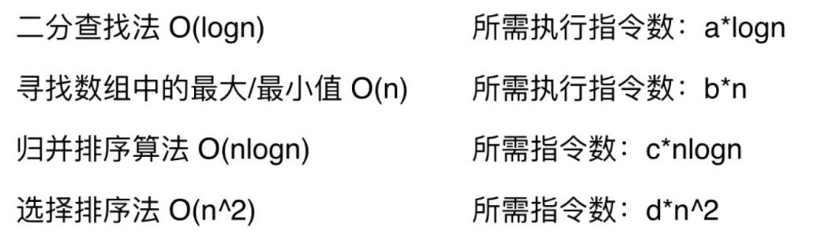
    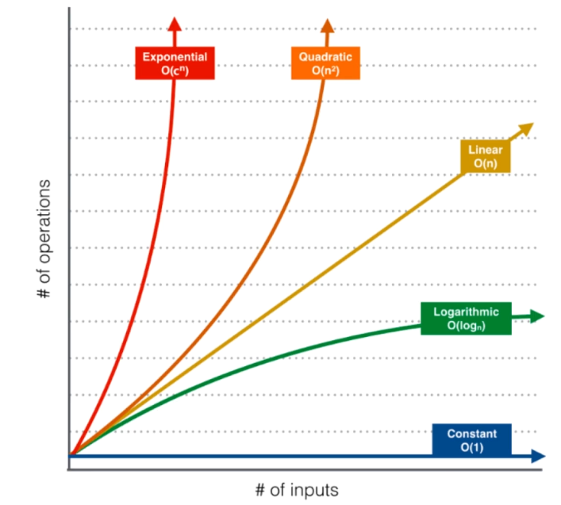
    
- 学界与业界的表示法

	- 学术上，$O(f(n))$ 表示算法执行的**上界**
	- 业界上，$O(f(n))$ 表示算法执行的**下界**

- 多种数据规模的时间复杂度

	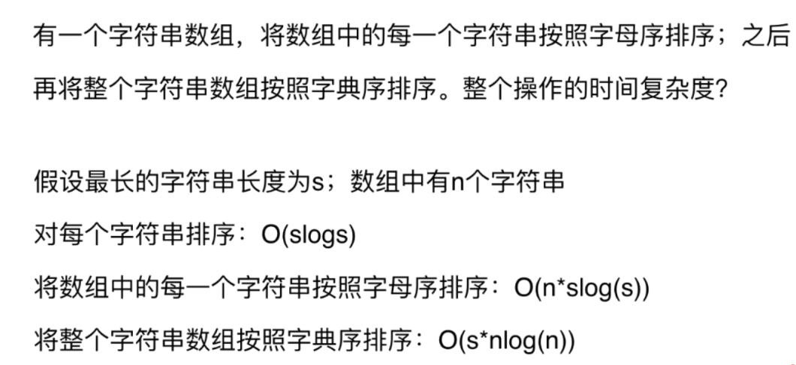
    
- 时间复杂度和测试用例也是相关的

- 数据规模的概念

	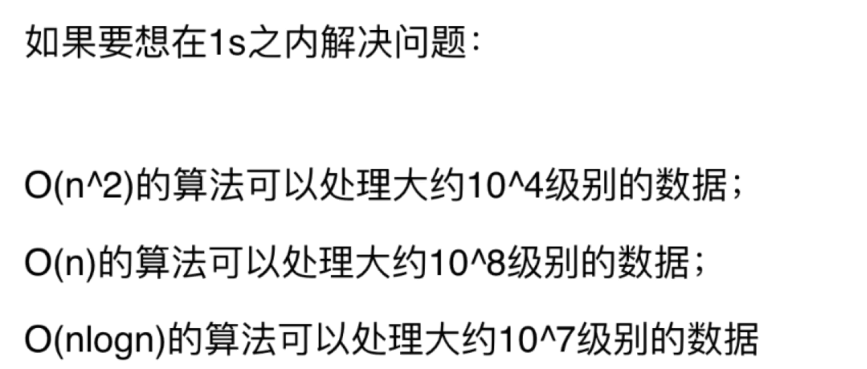

- 空间复杂度

	递归调用是有空间代价的

- 时间复杂度分析

	- $O(n)$
    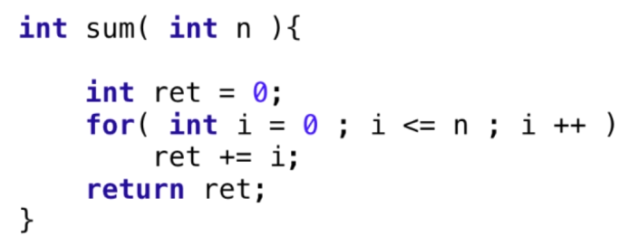
    
    - $O(n^2)$
    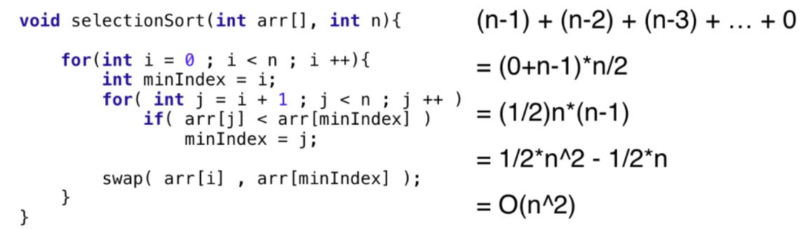

	- $O(logn)$

		- 二分查找
        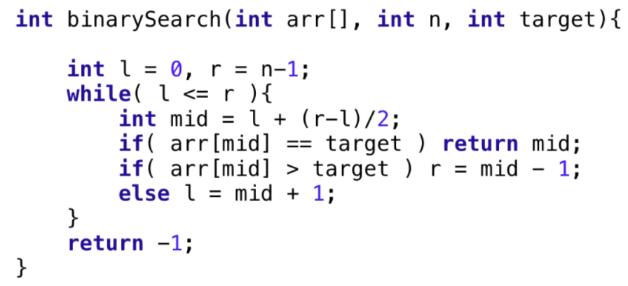
        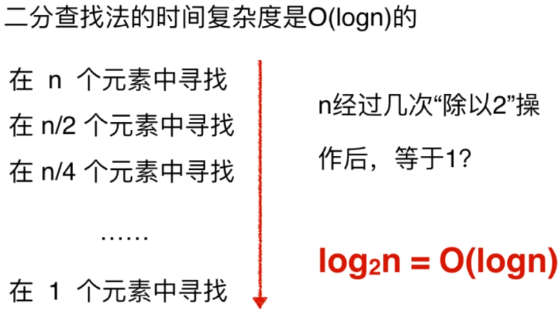
    	- 整型转字符串
        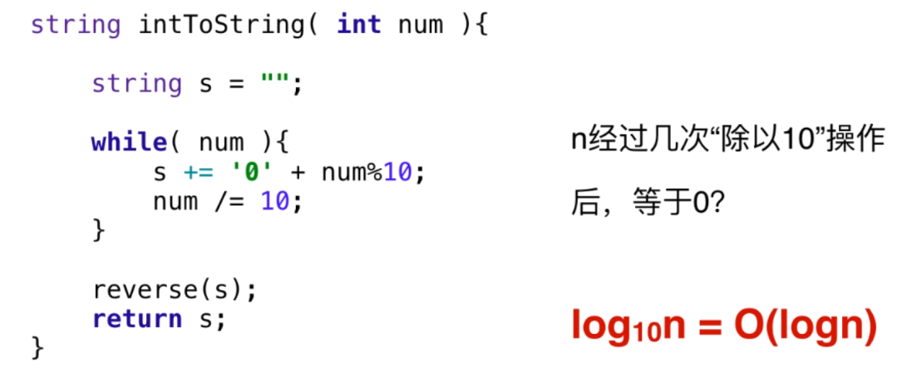
        - 折半遍历
		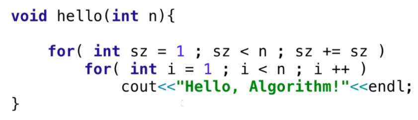
	
	- $O(\sqrt{n})$	
	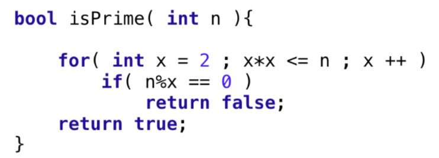
    
- 复杂度实验

	每次将数据规模提高两倍，看时间的变化，直接进行图像绘制更直观

- 递归算法复杂度分析

	- 如果递归函数中，只进行一次递归调用，递归深度为 $depth$, 在每个递归函数中，时间复杂度为$T$，则总体的时间复杂度为：
		$$O(T*depth)$$
        
        - 递归深度 $n$，时间复杂度 $O(n)$
        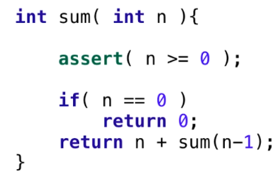
        
        - 递归深度 $logn$，时间复杂度 $O(logn)$
        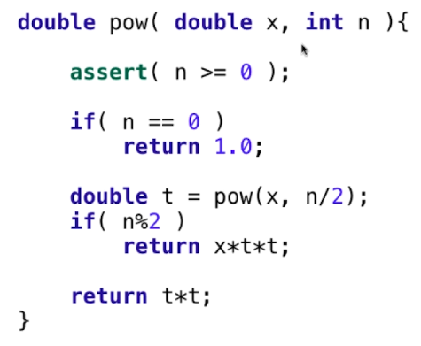
        
  - 递归中进行多次递归调用

	某种情况下，递归深度就是函数调用的次数，可以绘制递归调用树来解决
    
- 均摊复杂度分析

	不同操作的时间复杂度不同，则从平均角度看到的复杂度
    
    例如动态数组的 push back 操作以及 delete 带来的动态内存分配