## 数组问题

- **1. 数组的区间与边界问题** - 以二分查找法为例

	- 闭区间定义下的搜索
	```C++
    int binarySearch(int arr[], int n, int T)
    {
    	int l = 0, r = n-1; // 在[l,r]闭区间内寻找 T
        // 所以当 l = r ,区间还有一个元素，仍然满足搜索条件，所以是<=
        while (l<=r)
        {
        	int mid = l + (r-l)/2; // 防止整型溢出
            ···
            if (T > arr[mid])
            	// target 在 [mid+1 ... r] mid肯定不是，所以排除
            	l = mid + 1; 
            else if (T < arr[mid])
            	r = mid - 1;
        	···
        }
        // 离开了循环 l>r 区间无效，直接返回
        return -1;
    }
    ```

 - 开区间定义下的搜索
	```C++
    int binarySearch(int arr[], int n, int T)
    {
    	int l = 0, r = n; // 在[l,r) 前闭后开区间内寻找 T
        // 所以当 l = r ,区间已经没有元素，不满足搜索条件，所以是<
        while (l<r)
        {
        	···
            if (T > arr[mid])
            	// target 在 [mid+1 ... r) mid肯定不是，所以排除
            	l = mid + 1; 
            else if (T < arr[mid])
            	r = mid;  target 在 [l, mid) mid不包含，所以不是 mid - 1
        	···
        }
        // 离开了循环 l=r 区间无效，直接返回
        return -1;
    }
    ```
 - 总结

	明确定义变量的含义；对循环变量定义的不变性；小数据量加速调试；大数据量测试

- **2. Move Zeros**

	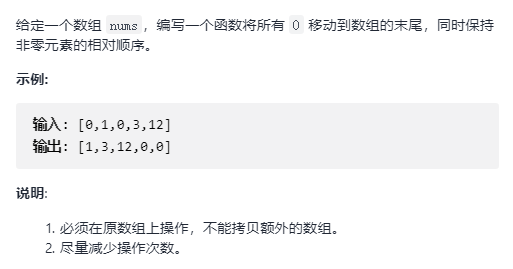
    
    - 思路1 （使用额外空间）
		
        时间复杂度 - O(n)
        
        空间复杂度 - O(n)
		
        获取非 0 元素，重新放入数组，其他置 0
        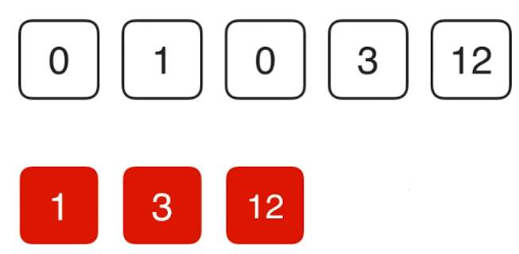
        
        ```C++
        void moveZeroes(vector<int>& nums) 
        {
			vector<int> nonzeros;
            for (auto ele : nums)
            	if (ele != 0)
                	nonzeros.push_back(ele)
            for (int i = 0; i < nums.size() - nonzeros.size(); ++i)
            	nonzeros.push_back(0);
    	}
        ```

	- 思路2 

		双指针
        
        时间复杂度 - O(n)
        
        空间复杂度 - O(1)
        
        定义 k， 在 [0, k) 中保存遍历过的非零元素
        
        - 每遍历到一个非 0 元素，将 位置 k 的元素赋值，直到数组遍历完毕
        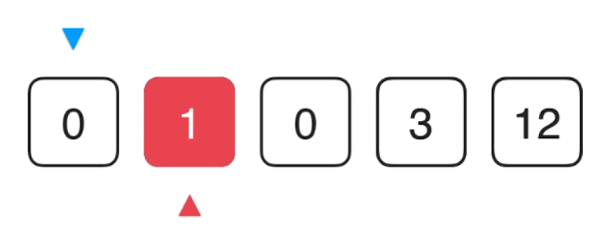
        
        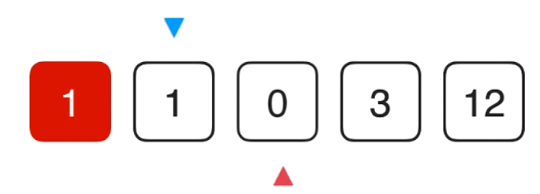
        
        - 继续移动 k 赋值元素为 0 
        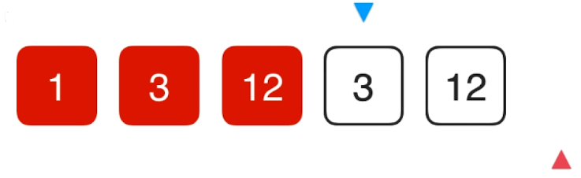
        ```C++
        void moveZeroes(vector<int>& nums) 
        {
			int i = 0; // [0,k) 区间非 0
            
            for (int j = 0; j < nums.size(); ++j)
            {
            	if (nums[j] != 0)
                {
                	nums[i++] = nums[j];
                }
            }
            
            for (int k = i; k< nums.size(); ++k)
            {
            	nums[k] = 0;
            }
            
    	}
        ```
  
  - 思路3

	交换替代赋值
    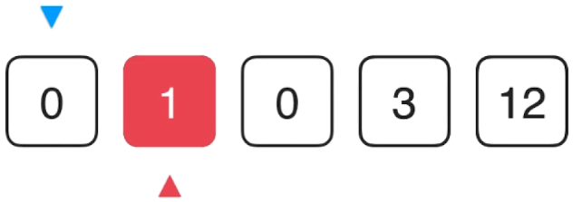
    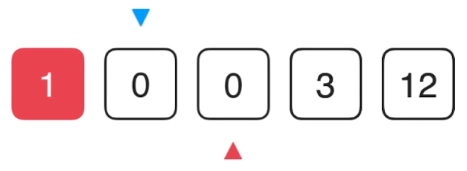
    
    ```C++
    void moveZeroes(vector<int>& nums) 
    {
        int i = 0;
        
        for (int j = 0; j < nums.size(); j++)
        {
            // 少了些交换
        	if (nums[i] != 0)
            {
            	i++;
            }
            else if (nums[j] != 0)
            {
            	swap(nums[i], nums[j]);
                i++;
            }
        }

    }
  ```
 
 - 思路4

	双指针，两路快排思路   
    
- **3. Sort Colors**

	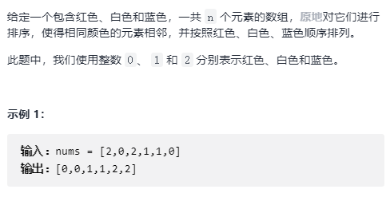
   
   - 题目分析

		简单的排序，但是**只有3种数值**
        
   - 思路1

	计数排序
    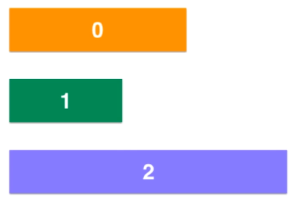
    

	```C++
    void sortColors(vector<int>& nums) 
    {
        int i = 0;
       	vector<int> counts(3);
        
        for (auto ele : nums)
        {
        	counts[ele]++;
        }
        
        int count = 0;
        for (int i = 0; i<3; i++)
        {
        	for (int c = 0; c<counts[i]; ++c)
            {
            	nums[count] = i;
                count++;
            }
        }
    }
  ```
  
 - 思路2 
	
    三路快排
    
    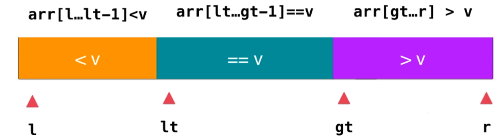
    
    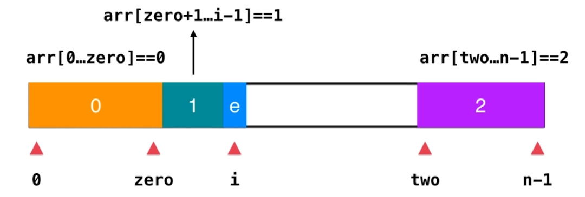
    - 如果e为1，i++，向后判断
    - 如果e为2，i 位置与 two - 1不变，two--
    - 如果e为0，i 位置元素与 zero+1 交换，i++， zero++

	```C++
    void sortColors(vector<int>& nums) 
    {
        int zero = -1；// 注意是闭区间的定义如此
        int two = nums.size();
        int i = 0;
        while (i<two)
        {
        	if (nums[i] == 0)
            	swap(nums[i++], nums[++zero]);
            else if (nums[i] == 2)
            	swap(nums[i], nums[--two]);
            else
            	i++;
        }
    }
  ```

- **3. 有序数组的两数之和**

	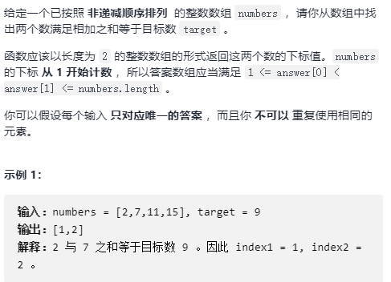   
    
    - 思路1

		暴力解法，双层遍历，时间复杂度： $O(n^2)$
        
    - 思路2

		基于有序数组的二分查找, 时间复杂度： $O(nlogn)$
           
        
    - 思路3
    	
        对撞指针, 时间复杂度： $O(n)$
		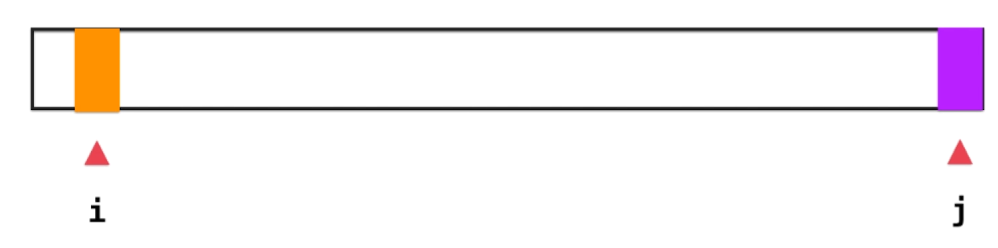 
        
        - $nums[i] + nums[j] < target: i++$
        - $nums[i] + nums[j] > target: j--$
		
        ```C++
        vector<int> twoSum_sort(vector<int>& nums, int T) 
        {
            int i = 0;
            int j = nums.size() - 1;
            vector<int> res;
            while (i < j)
            {
            	if (nums[i] + nums[j] == T)
                {
                	res.push_back(i+1);
                    res.push_back(j+1);
                }
                else if (nums[i] + nums[j] < T)
                	i++;
                else
                	j--;
            }
            
            throw invalid_argument("Error!")
        }
      ```
      
  - 扩展

	回文串，翻转字符串等
 
- **4. 长度最小的子数组**
	
    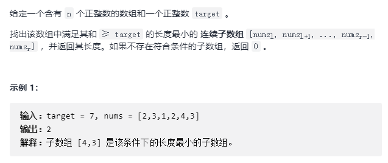 

	- 思路1

		暴力解法，遍历 i,j 对区间[i,j]的数组进行条件判定
        
        时间复杂度： $O(n^3)$(包含大量重复计算)
	- 思路2

		**滑动窗口** 基本流程
        
        - 初始窗口状态 闭区间[i,j]
		 
        
        - 窗口调节规则

			- $sum(nums[i···j]) < target$，窗口向右扩大，直到$sum(nums[i···j]) >= target$
			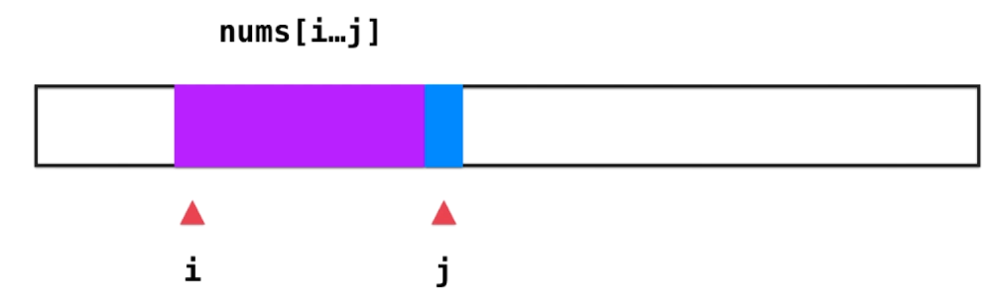 
            - $sum(nums[i···j]) >= target$，保存解，并把窗口向左缩小，直到$sum(nums[i···j]) < target$
            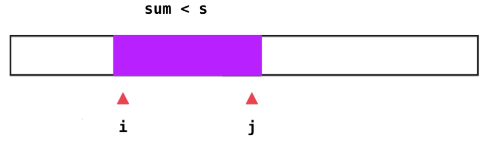 
        
     ```C++
     // 滑动窗口编码范式
    int minSubArrasyLen(vector<int>& nums, int T) 
    {
           int i = j = 0; // [i,j] 闭区间
           int n = nums.size(); 
           int sum = nums[i];
           int res = n;
           // 对 i 进行循环
           while (i < n)
           {
                // j 可能越界
                if (j < n && sum < T) 
                    sum += nums[++j];
                else
                	sum -= nums[--i];
                
                if (sum >= T)
                	res = _min(res, j-i+1);
           }
           
           if (res == nums.size())
           		return 0;
           return res;
    }
  ```
		 
- **5.无重复字符的最长子串**

	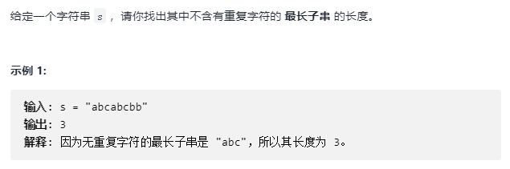 
  
  - 思路1
  
  	**滑动窗口**
    
     - 初始窗口状态 闭区间[i,j]
		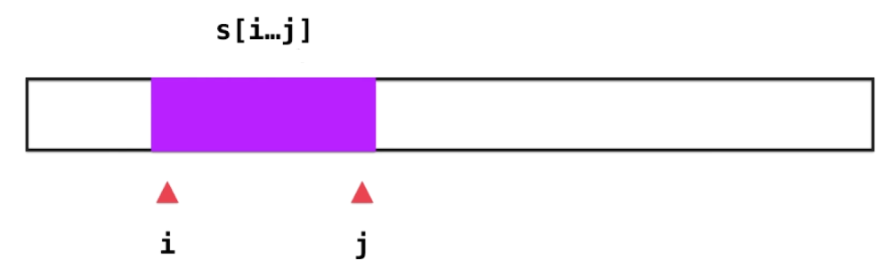 
        
     - 窗口调节规则

		- $s[i···j]$ 不含重复字符，窗口向右扩大（$j++$），直到$s[i···j]$含重复字符
		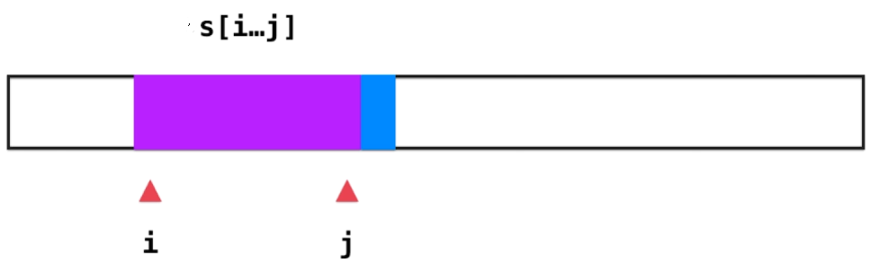 
        
        - $s[i···j]$ 含重复字符，将之前结果进行更新，并把窗口向左缩小（$i++$），直到$s[i···j]$不含重复字符(不需要循环)
		 
        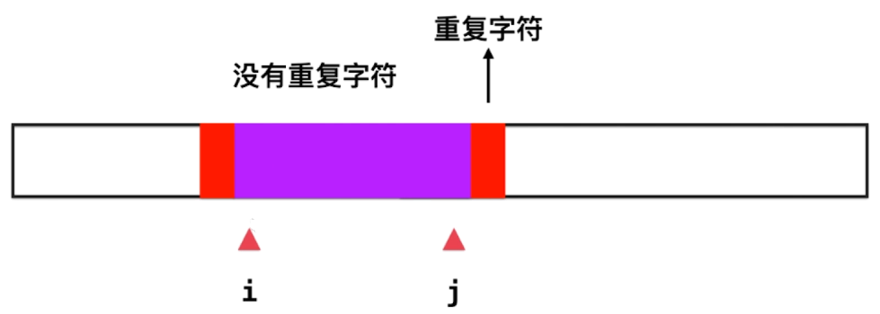 
    
   	- **重复字符判定技巧**

		开辟数组，频率统计
        
	```C++
     // 滑动窗口编码范式
    int lengthOfLongestSubstring(string s)
    {
          int i = 0;
          int j = -1;
          int freq[256] = {0};
          int n = s.size();
          int res = 0;
          
          while (i < n)
          {
          		if (j+1 < n &&  freq[s[j+1]] == 0)
                {
                	j++;
                    freq[s[j]]++;
                }
                else
                {
                	i++;
                    freq[s[i-1]]--;
                }
                	
                res = _max(res, j-l+1);
          }
          
          return res;
    }
  ```	