## 查找表问题

- 查找问题的分类

    - 查找有无

        set

    - 对应关系查找

        map

- set 和 map 的常见操作

    - insert（插入key）
    - find（查找key）
    - erase（删除key）
    - change（改变key对应的value）

- **1. 两个数组的交集 - set 的使用**

	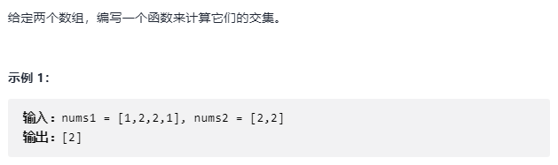
    
    - 思路

		使用 set
        
    ```C++
    #include <set>
    
    vector<int> intersection(vector<int>& nums1, vector<int>& nums2) 
    {
		 set<int> record;
         for (int i=0;i<nums1.size(); ++i)
         	record.insert(nums1[i]);
         set<int> result;
         for (int i=0;i<nums2.size(); ++i)
         	if (record.find(nums2[i]) != record.end()) // 相当于 in 操作				result.insert(nums2[i]);
         return vecotr<int>(result.begin(), result.end());
    }
    ```
 
- **2. 两个数组的交集 II - map 的使用** 

	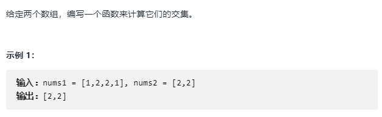
    
    - 思路

		使用 map
        
    ```C++
    #include <map>
    
    vector<int> intersection(vector<int>& nums1, vector<int>& nums2) 
    {
		 map<int,int> record;// 默认 value 为 0
         for (int i=0;i<nums1.size(); ++i)
         	record[nums1[i]]++;// 访问nums1[i]，相当于record[nums1[i]]=0
            
         vector<int> res;
         for (int i=0;i<nums2.size(); ++i)
         {
         	if (record[nums2[i]] > 0)
            {
            	res.push_back(nums2[i]]);
                record[nums2[i]]--;
            }
         }
         
         return res;
    }
    ```
    
    标准写法
    
    ```C++
    #include <map>
    
    vector<int> intersection(vector<int>& nums1, vector<int>& nums2) 
    {
		 map<int,int> record;// 默认 value 为 0
         for (int i=0;i<nums1.size(); ++i)
         	if (record.find(nums1[i]) == record.end()))
            {
            	record.insert(make_pair(nums1[i], 1));
            }
            else
         		record[nums1[i]]++;
            
         vector<int> res;
         for (int i=0;i<nums2.size(); ++i)
         {
         	if (record.find(nums2[i]) == record.end() && record[nums2[i]] > 0)
            {
            	res.push_back(nums2[i]]);
                record[nums2[i]]--;
                if (record[nums2[i]] == 0)
                	record.erase(nums2[i]);
            }
         }
         
         return res;
    }
    ```
    
- set 和 map 的底层实现

	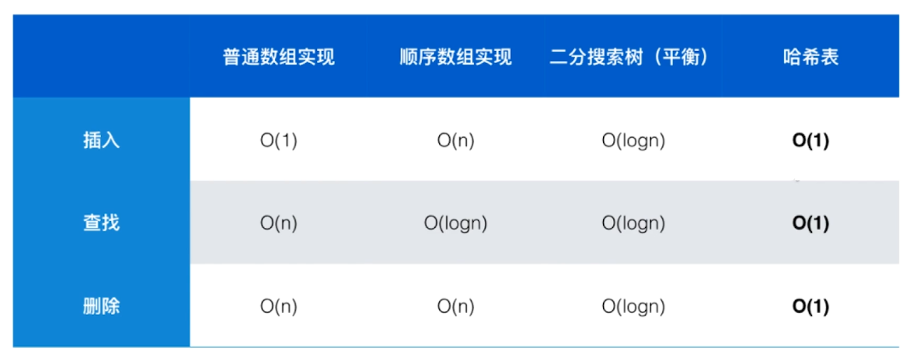
    
    - c++ 中，map 和 set 的底层实现为平衡二叉树；unordered map 和 unordered set 的底层实现为哈希表

- **3. 两数之和**

	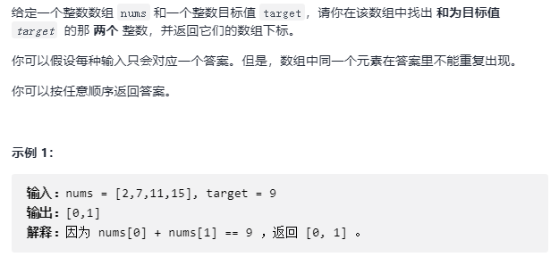
    
    - 思路

		暴力解法（$O(n^2)$）
        
        双指针（有序数组，需要先排序）（$O(nlogn + n)$）
        
        查找表方法：
        
        将元素一边放入查找表，一边对于每一个元素$a$,查找 $target - a$ 是否存在（将所有元素放入 map 再次查找会出现重复元素无法解决）
        
    
    ```C++
    vector<int> twoSum(vector<int>& nums, int target) 
    {
    	 vector<int> res(2);
    	 map<int,int> record;
         for (int i=0; i<nums.size(); ++i)
         {
         	
            if (record.find(target - nums[i]) != record.end() && record[nums2[i]] > 0)
            {
                res[0] = record[target - nums[i]] - 1;
                res[1] = i-1;
            }
            // 由于默认 record[nums[i]] = 0
            record[nums[i]] = i+1;

         }
		
         return res;
    }
    ```

- **4. 四数之和 ||**
	
    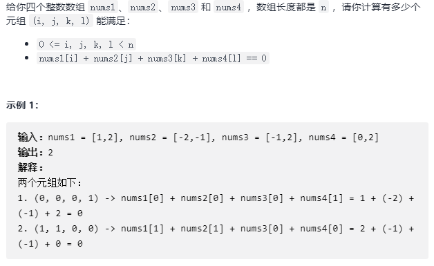
    
    使用 map 将 C + D 的所有可能加入 map，注意不用返回结果，只要返回个数就可以，所以 map 记录了 $C[i] + D[i]$ 对应出现的次数
    
    ```C++
    int fourSumCount(vector<int>& nums1, vector<int>& nums2, vector<int>& nums3, vector<int>& nums4) 
    {
    	map<int,int> record;
		for ( auto ele3 : nums3)
        	for (auto ele4 : nums4)
            	record[ele3+ele4]++;
        int res = 0;
        for (auto ele1 : nums1)
        	for (auto ele2 : nums2)
            	if (record.find(0-(ele1+ele2)) != record.end())
                	res += record[-(ele1+ele2)];
    	return res;
    }
    ```
 
- **4. 回旋镖的数量** 

	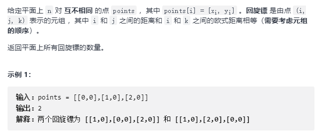
    
    - 思路
		
        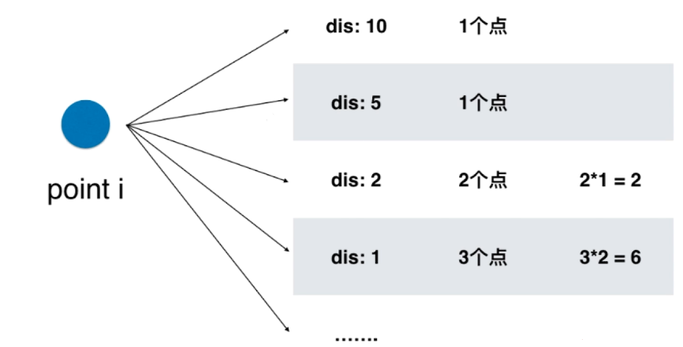
		
        统计一个点到其他点的相同距离的个数，并从中计算匹配的个数
    
    	```C++
        int numberOfBoomerangs(vector<vector<int>>& points) 
        {
			int res = 0;
            map<int, int> record;
            
            for (int i=0; i < points.size(); ++i)
            	for (int j=0; j < points.size(); ++j)
                	if (i != j)
                    	record[dis(points[i], points[j])]++;
            for (auto ele : record)
            	res += ele.second * (ele.second - 1);
            
            return res;
    	}
        ```
        
- **5. 存在重复元素 II** 

	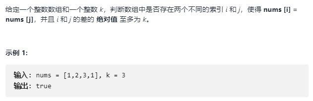
    
    - 思路
		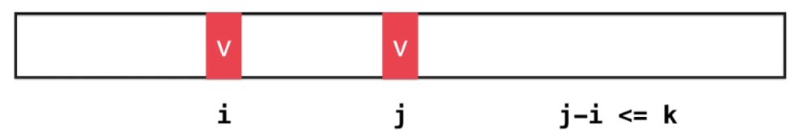
		- 滑动窗口

			- 查找 [l, l+k] 的区间是否存在相同的元素
			- 如果没有，则区间向右移动
			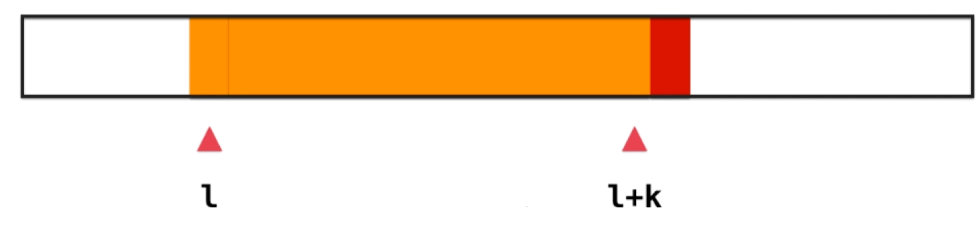
            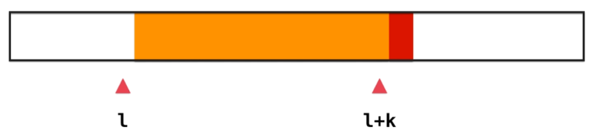
            - 首先查看右边红色的元素是否存在蓝色的区间中，如果有则找到
            
            - 如果没有，则继续向下查找
            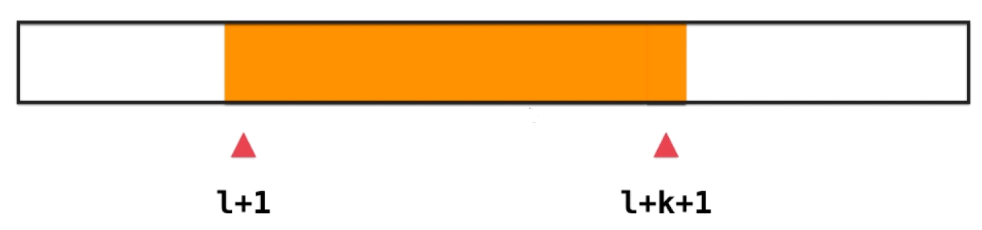

		```C++
        bool containsNearbyDuplicate(vector<int>& nums, int k) 
        {
			int l = 0;
            int n = nums.size();
            
            set<int> record;
            for (int i=0; i<k; i++)
            {
            	if (record.find(nums[i]) == record.end())
                	record.insert(nums[i]);
                else
                	return true;
            }
            
            while (l + k + 1 < n)
            {
                record.erase(nums[l])
                l += 1;
                if (record.find(nums[l + k + 1]) == record.end())
                	record.insert(nums[l+k+1]);
                else
                	return true;
            }
            return false;
   	   }
        ```
        
        - **固定长度的滑动窗口编程方法**

		```C++
        bool containsNearbyDuplicate(vector<int>& nums, int k) 
        {
            set<int> record;
            for (int i=0; i<nums.size(); i++)
            {
            	if (record.find(nums[i]) != record.end())
                	return true;
                record.insert(nums[i]);
                
                // 维护窗口大小
                if (record.size() == k+1)
                	record.erase(nums[i-k]);
            }
  			return false;
   	   }
        ```
  
- **6. 存在重复元素 III** 
	
    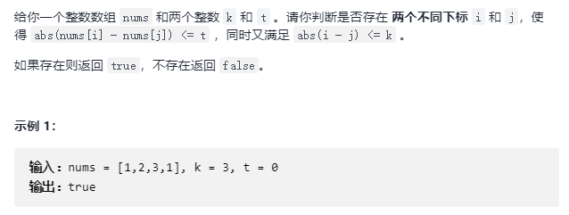
    
    - 思路
		
        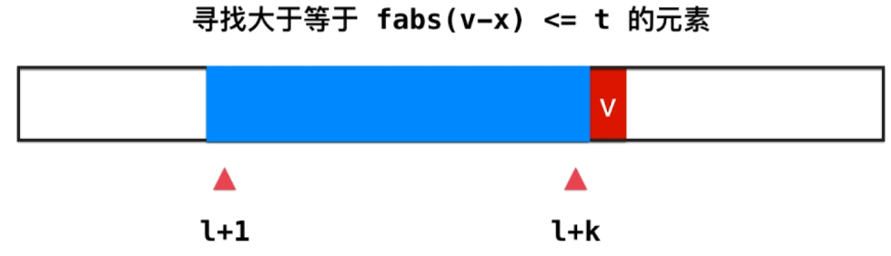
        
        也就查找元素值在 $[v-t,v+t]$ 之间
        
        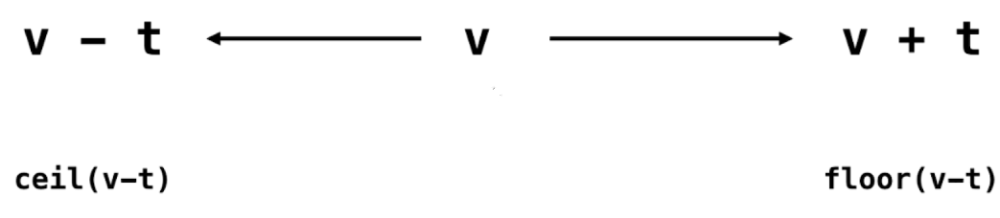
		
		```C++
        bool containsNearbyAlmostDuplicate(vector<int>& nums, int k, int t) 
        {
            set<int> record;
            for (int i=0; i<nums.size(); i++)
            {
            	if (record.lower_bound(nums[i] - t) != record.end() && *record.lower_bound(nums[i] - t) <= nums[i] + t)
                	return true;
                record.insert(nums[i]);
                
                // 维护窗口大小
                if (record.size() == k+1)
                	record.erase(nums[i-k]);
            }
  			return false;
   	   }
        ```

- **7. 链表节点删除** 