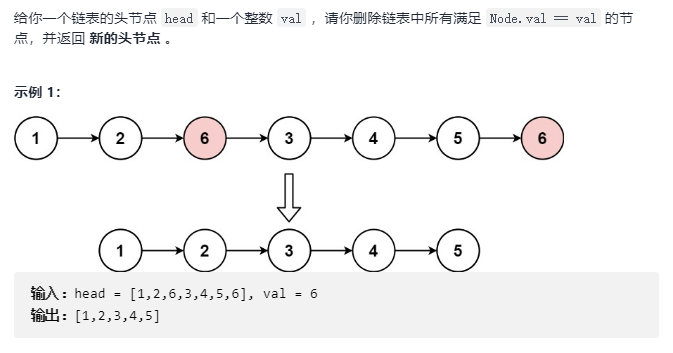

## 链表问题

- 链表问题表述

	- 链表和数组都属于顺序表，链表问题的核心是通过使用链表的操作完成顺序表的问题，该问题的核心是操作顺序表的 **next** 指针

	- 链表问题往往需要使用中间变量保存前后节点更多的信息
    
    - 一旦涉及到 next 使用，就必须想到 next 是否存在

- **1. 反转链表**

	
    
	- 思路

		- 链表问题不应该改变节点的值
		
        
        - 算法流程
        	- 初始化 cur 指向 head，并保存 next 节点， 保存前一个节点 pre
        	
            - **将 cur 的 next 指向pre ， pre， cur ， next 向后移动**
                
                
            - 依次上述操作，直到 cur 为空

		- 代码实现

			```C++
            /**
             * Definition for singly-linked list.
             * struct ListNode {
             *     int val;
             *     ListNode *next;
             *     ListNode() : val(0), next(nullptr) {}
             *     ListNode(int x) : val(x), next(nullptr) {}
             *     ListNode(int x, ListNode *next) : val(x), next(next) {}
             * };
             */
            class Solution {
            public:
                ListNode* reverseList(ListNode* head) 
                {
					ListNode* pre = nullptr;
                    ListNode* cur = head;
                    ListNode* nxt = nullptr;
                    
                    // cur 如果是空，直接返回
                    while (cur)
                    {
                    	// 保存中间指针
                    	ListNode* nxt = cur->next;
                        // 反转
                    	cur->next = pre;
                        // 更新指针
                        pre = cur;
                        cur = nxt;
                    }
                    
                    return pre; // 链表新的 head
                }
            };
            ```
            
- **2. 指定链表节点删除**

    
  
  - 思路：

	- 删除头节点的思路
	
    	**采用哨兵节点，否则头部节点连续多个都是需要删除的节点（对于删除节点问题常用）**
          
	- 删除中间节点的思路
	 
    
 - 代码实现

	```C++
    class Solution {
    public:
        ListNode* removeElements(ListNode* head, int val) 
        {
        	// 加入哨兵节点
			ListNode* dummy_node = new ListNode(0);
            dummy_node->next = head;
            
            ListNode* cur = dummy_node;
            while(cur)
            {
            	if (cur->next.val == val)
                {
                	ListNode* delNode = cur.next;
                    cur->next = delNode->next;
                    delete delNode;
                }
                else
                	cur = cur->next;
            }
            // 哨兵节点处理
            ListNode* retNode = dummy_node->next;
            delete dummy_node;
            return retNode;
        }
    };
    ```
		
- **3. 两两交换链表中的节点**     

	 
    
    - 解题思路

		- dummy head

		 
        
        - 从后向前交换指向顺序
		
         
        
        - 更新标记的 node 指针
        
         
        
  - 代码实现

	```C++
    class Solution {
    public:
        ListNode* swapPairs(ListNode* head) 
        {
			ListNode* dummy_node = new ListNode(0);
            dummy_node->next = head;
            
            ListNode* p = dummy_node;
            
            while(p->next && p->next->next)
            {
            	// 存储中间节点
            	ListNode* node1 = p->next;
            	ListNode* node2 = node1->next;
            	ListNode* nxt = node2->next;
            	// 反转
                node2->next = node1;
                node1->next = next;
                p->next = node2;
                
                p = node1;
            }
            
            ListNode* retNode = dummy_node->next;
            delete dummy_node;
            return retNode;
        }
    };
    ```
    
- **4. 删除给定链表节点**    
	
     
    
    - 思路

		由于无法获得前一个节点，只能通过赋值进行
        
        
        
   	- 代码实现

		```C++
        class Solution {
        public:
            void deleteNode(ListNode* node) {
				if (node == NULL)
                	return;
                if (node->next == NULL)
                {
                	delete node;
                    node = NULL;
                    return;
                }
                
                node->val = node->next->val;
                ListNode* delNode = node->next;
                node->next = delNode->next;
                delete delNode;
                
                return;
            }
        };
        ```
        
- **5. 删除链表的倒数第 N 个结点**     
	
    
    - 思路1

		首先确定链表的总长度，反算出需要经过多个节点（遍历）
        
    - 思路2

		双指针，固定双指针之间的距离
        
        
        
        ```C++
        class Solution {
        public:
            ListNode* removeNthFromEnd(ListNode* head, int n) {
				ListNode* dummy_node = new ListNode(0);
                dummy_node->next = head;
				ListNode* sp, fp;
                sp = fp =  dummy_node;
                
                for (int i=0; i<n+1; i++)
                {
                	if (fp == NULL)
                    	return;
                	fp = fp.next;
                }
                
                while (fp != NULL)
                {
                	sp = sp->next;
                    fp = fp->next;
                }
                ListNode* retNode = dummy_node->next;
                delete dummy_node;
                return retNode;	
            }
        };
        ```