## 栈与队列

- **1. 有效的括号**

	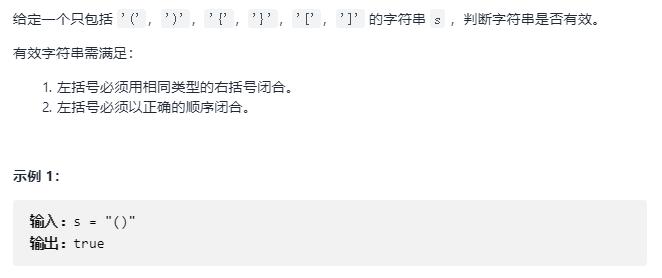
    
    - 思路

		栈顶元素反映了在嵌套的层次关系中，最近的需要匹配的元素
		
		- 遍历输入字符串

			- 只要是左括号就压入栈
			
            
            - 遇到右括号

				- 如果栈顶就是对应的左括号，就直接弹栈
				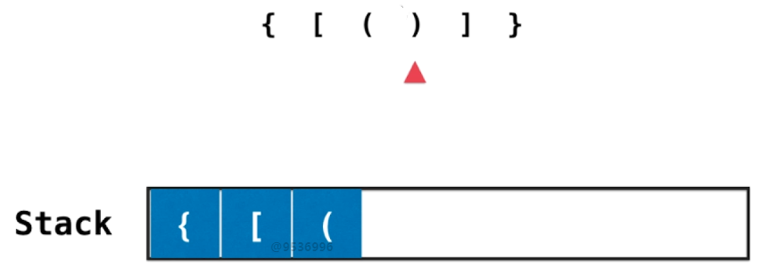
                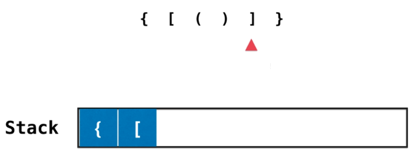
                - 否则，栈不为空，则不是有效括号匹配
        - 最后需要判断栈是否为空    
   
  - 代码实现

    ```C++
    bool isValid(string s) {
        stack<char> st;

        for (auto c : s)
        {
            if (c == '(' || c == '[' || c == '{')
                st.push(c);
            else:
                if (st.empty())
                    return false;
                char c = st.top();
                st.pop();

                char match;
                if (c == ')')
                    match = '(';
                elif (c == ']')
                    match = '[';
                else
                    match = '{';

                if (match != c)
                    return false;
        }

        if (st.empty())
            return true;
        return false;

    }
    ```

- 栈和递归的紧密关系

	- 以二叉树的前序遍历查看递归调用流程

		- 递归调用时，将当前调用信息压入栈中，并转向调用自己，这时候调用的递归函数与原本无关
        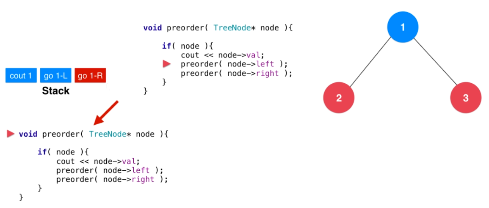
        
        - 递归调用结束时，将会弹出栈顶元素，返回调用栈前的状态
        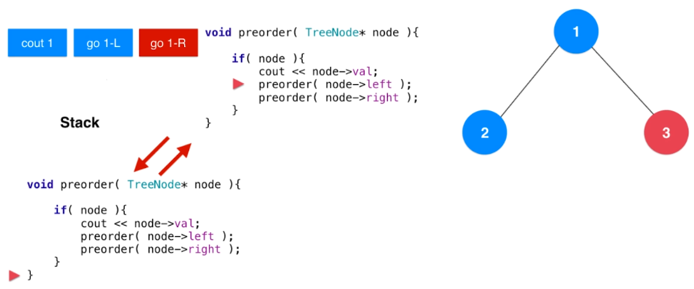
        
        - 主函数将继续往下执行
        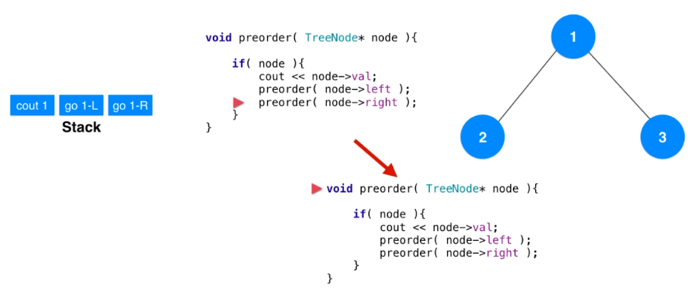
        

- 使用栈模拟递归

	- 初始化栈：压入待执行的指令 go 1
	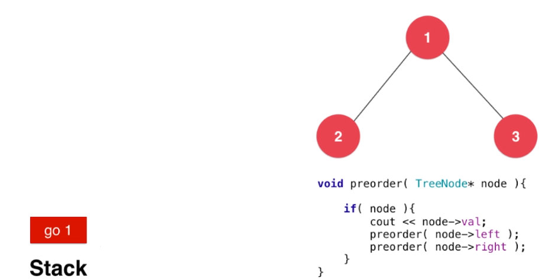
    
    - 执行栈中命令直到为空

		- 弹栈获取第一条指令
		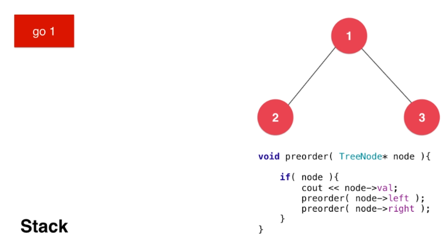
        
        - 压入第一条指令的具体函数
		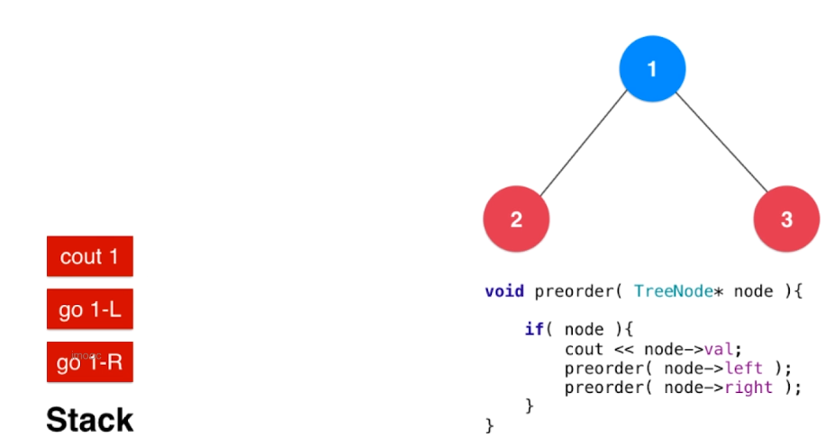
        
    ```C++
    struct Command
    {
    	string s;
        TreeNode* node;
        Command(string s, TreeNode* nod): s(s), node(node) {}
    }
    
    vector<int> preOrderTravel(TreeNode* root)
    {
    	vector<int> res;
        if (root == NULL)
        	return res;
            
        stack<Command> sc;
        sc.push(Command("go", root));
        
        while (!sc.empty())
        {
        	Command c = sc.top();
            sc.pop()
            if (c.s == "go")
            {
            	// 压入 go 指令的函数, 压入顺序与函数执行顺序相反
                sc.push(Command("go", c.node->right));
                sc.push(Command("go", c.node->left));
                // print 的 位置决定 前中后序
                sc.push(Command("print", c.node));
            }
            else # print
            {
            	res.push_back(c.node->val);
            }
        }
        
        return res;
    }
    ```
			

- **1. 二叉树的层序遍历**

	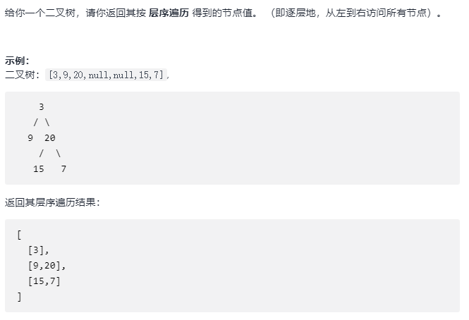
    
- 解题思路    
			
	队列的基本应用
    
- 核心代码

	```C++
    vector<vector<int>> levelOrder(TreeNode* root) {
		vector<int> res;
        
        if (root == NULL)
        	return res;
        
        queue<pair<TreeNode*, level>> q;
        q.push(make_pair(root, 0));
        
        while (!q.empty())
        {
        	TreeNode* node = q.front().first;
            int level = q.front().second;
            q.pop();
            
            if (level == res.size())
            	res.push_back(vector<int>());
                
            res[level].push_back(node->val);
            
            if (node->left)
            	q.push(make_pair(node->left, level+1);
            if (node->right)
            	q.push(make_pair(node->right, level+1);
        }
        return res; 
    }
    ```

- **2. 完全平方数**

	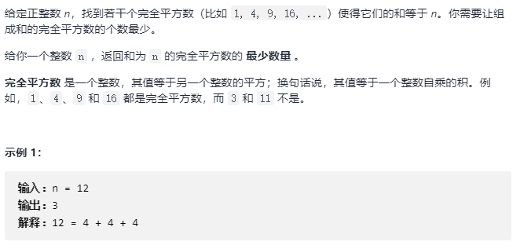

- 求解思路

	使用 BFS 求解图的最短路径
    
    对问题进行建模：
    从 $n$ 到 $0$，每个数字表示一个节点，如果两个数字 $x$ 到 $y$ 相差一个完全平方数，则链接一条边，从大数指向小数，求这个无权图 从 $n$ 到 $0$ 的最短路径
    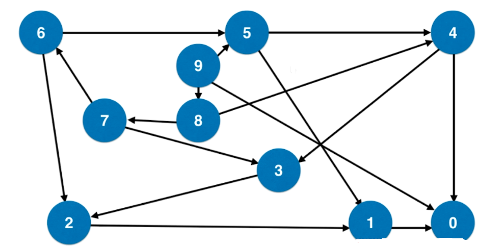
    
- 核心代码

	```C++
    int numSquares(int n) {
    	// 第一个 int 表示 数值， 第二个 int 表示 step （经过step 到达 0）
		queue<pair<int, int>> q;
        q.push(make_pair(n, 0));
        vector<bool> visited(n+1, false);
        visited[n] = true;
        while (!q.empty())
        {
        	int num = q.front().first;
            int step = q.front().second;
            q.pop();
            
            if (num == 0)
            	return step;
                
            for (int i = 1; num - i*i >= 0; i++)
            {
            	if (!visited[num - i*i])
                {
                	q.push(make_pair(num - i*i, step + 1));
                    visited[num - i*i] = true;
                }
            }
        }
    }
    ```
    
- 类似问题

	127; 
    

- 优先队列 priority_queue

	底层实现：使用堆
    
    **C++ 的 priority_queue 是最大堆**
    
- **3. 前 K 个高频元素**

	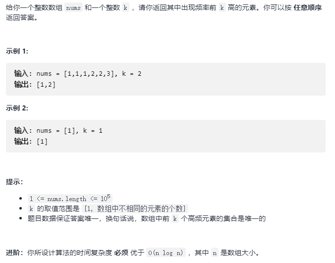
    
- 解题思路

	思路1：
     
      通过 map 统计元素频率，然后进行排序
        
    思路2：
    
      使用优先队列：
      
      维护一个含有 k 个元素的优先队列。如果遍历到的元素比队列中的最小频率元素的频率高，则取出队列中最小频率的元素，将新元素加入队列，最终，优先队列中剩下的就是结果。
      
- 核心代码

	```C++
    vector<int> topKFrequent(vector<int>& nums, int k) {
		unordered_map<int, int> freq;
        
        // 建立map
        for (auto num : nums)
        	freq[num]++;
        // first 表示 频率 ， second 表示 元素
        priority_queue<pair<int, int>, vector<pair<int, int>>, greater<pair<int, int>> > pq;
        for (auto iter = freq.begin(); iter != freq.end(); ++iter)
        {
        	if (pq.size() == k)
            {
            	if (iter->second > pq.top().first)
                {
                	pq.pop();
                    pq.push(make_pair(iter->second, iter->first));
                }
                else
                	pq.push(make_pair(iter->second, iter->first));
            }
        }
        
        vector<int> res;
        
        while(!pq.empty())
        {
 			res.push_back(pq.top().second);
            pq.pop();
        }	
        return res;
    }
    ```