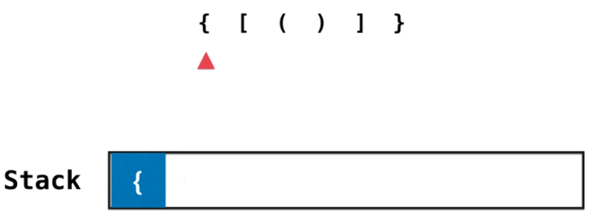

## 栈与队列

- **1. 有效的括号**

	
    
    - 思路

		栈顶元素反映了在嵌套的层次关系中，最近的需要匹配的元素
		
		- 遍历输入字符串

			- 只要是左括号就压入栈
			
            
            - 遇到右括号

				- 如果栈顶就是对应的左括号，就直接弹栈
				
                
                - 否则，栈不为空，则不是有效括号匹配
        - 最后需要判断栈是否为空    
   
  - 代码实现

    ```C++
    bool isValid(string s) {
        stack<char> st;

        for (auto c : s)
        {
            if (c == '(' || c == '[' || c == '{')
                st.push(c);
            else:
                if (st.empty())
                    return false;
                char c = st.top();
                st.pop();

                char match;
                if (c == ')')
                    match = '(';
                elif (c == ']')
                    match = '[';
                else
                    match = '{';

                if (match != c)
                    return false;
        }

        if (st.empty())
            return true;
        return false;

    }
    ```

- 栈和递归的紧密关系

	- 以二叉树的前序遍历查看递归调用流程

		- 递归调用时，将当前调用信息压入栈中，并转向调用自己，这时候调用的递归函数与原本无关
        
        
        - 递归调用结束时，将会弹出栈顶元素，返回调用栈前的状态
        
        
        - 主函数将继续往下执行
        