## 二叉树天然的递归结构

- 递归程序的组成 
	
    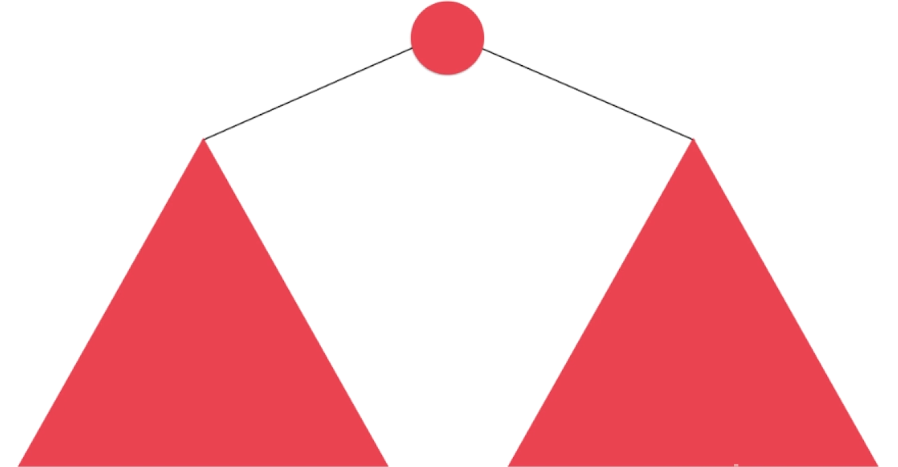
	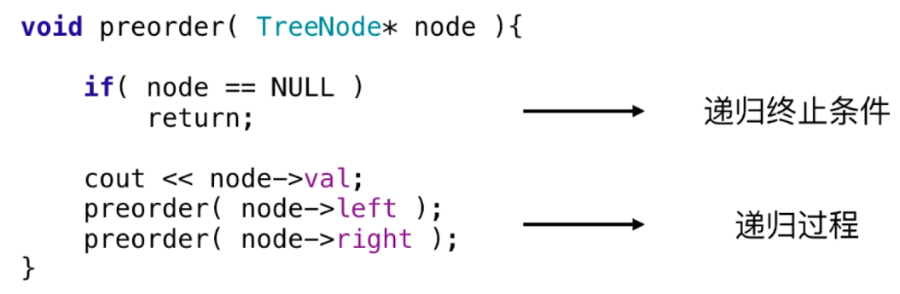
    
- **1. 二叉树的最大深度**    
	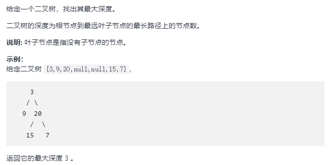

	- 解题思路

		递归思路
        
    - 核心代码

		```C++
        int maxDepth(TreeNode* root) {
			if (root == NULL)
            	return 0;
                
            return max(maxDepth(root->left), maxDepth(root->right)) + 1;
    	}
        ```
        
- **2. 翻转二叉树**

  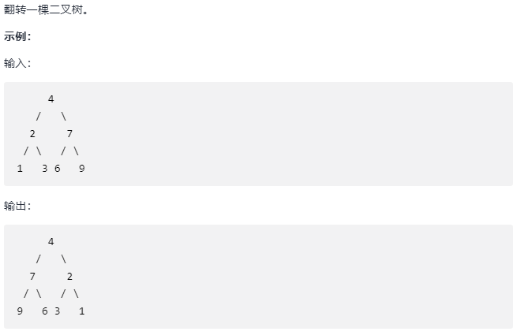
  
  - 解题思路

	递归算法，处理递归终止条件（节点为空），递归处理左右子树
    
   - 核心代码

		```C++
        TreeNode* invertTree(TreeNode* root) {
			if (root == NULL)
            	return NULL;
            
            invertTree(root->left);
            invertTree(root->right);
            swap(root->left, root->right);
            
            return root;
    	}
        ```

- **3. 路径总和**

	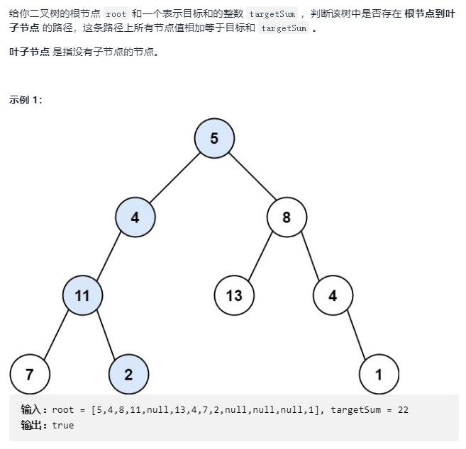
    
	- 解题思路

		注意到递归的终止条件是叶子结点
        
    - 核心代码

		```C++
        bool hasPathSum(TreeNode* root, int targetSum) {
			if (root == NULL)
            	return false;
     		if (root->left == NULL && root->right == NULL)
            	return root->val == targetSum;
            
            if (hasPathSum(root->left, targetSum - root->val))
            	return true;
            if (hasPathSum(root->right, targetSum - root->val))
            	return true;
                
            return false;
    	}
        ```
        
- **4. 二叉树的所有路径**     

	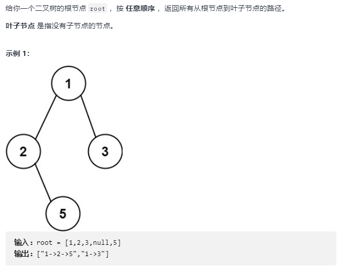
    
 - 解题思路

	递归向下直到叶子结点
	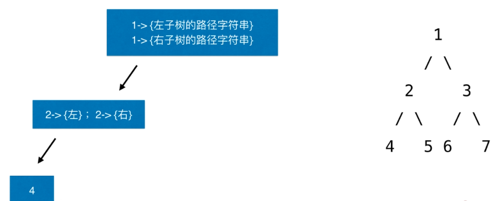  
    
    返回寻找组成答案
    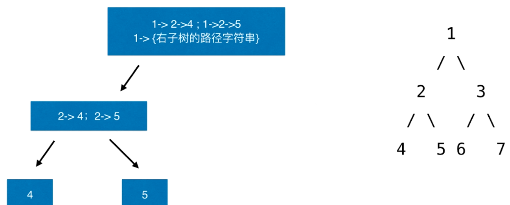  
    
 - 核心代码

	```C++
    vector<string> binaryTreePaths(TreeNode* root) {
		vector<string> res;
        
        if (root == NULL)
        	return res;
            
        if (root->left == NULL && root->right == NULL)
        {
        	res.push_back(to_string(root->val));
            return res;
        }
        
        vector<string> leftS = binaryTreePaths(root->left);
        for (int i=0; i < leftS.size(); ++i)
        	res.push_back(to_string(root->val) + "->" + leftS[i]);
            
        vector<string> rightS = binaryTreePaths(root->right);
        for (int i=0; i < rightS.size(); ++i)
        	res.push_back(to_string(root->val) + "->" + rightS[i]);
            
        return res;
    }
    ```
    
- **5. 路径总和 III**      

	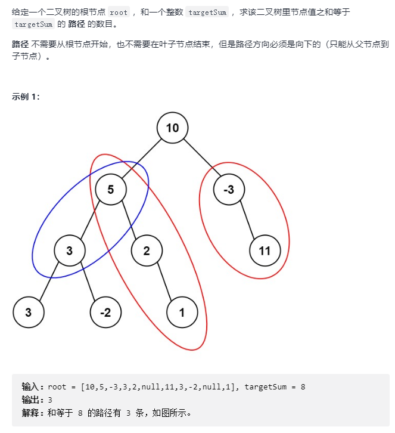
    
	- 解题思路 

		采用两种递归方式，分别递归搜索两种方式  
        
        1. 递归查找每个节点作为起始节点
        2. 以某个节点为起始节点递归查找组成的子节点
        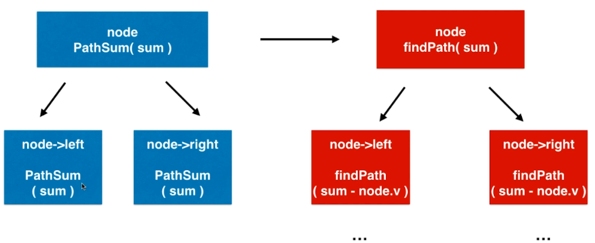
        
    - 核心代码

		```C++
        // 在以 root 为根节点的二叉树中， 寻找和为 sum 的路径个数
        int pathSum(TreeNode* root, int targetSum) {
			if (root == NULL)
            	return 0;
            
            int res = findPath(root, sum);
            res += pathSum(root->left, sum);
            res += pathSum(root->right, sum);
            
            return res;
   		}
        
        int findPath(TreeNode* node, int num) {
        	if (node == NULL)
            	return 0;
            
            int res = 0;
            if (node->val == num)
            	res += 1
            res += findPath(node->left, num - node->val);
            res += findPath(node->right, num - node->val);
            
            return res;
        }
        ```
        
- **6. 二叉搜索树的最近公共祖先**            

	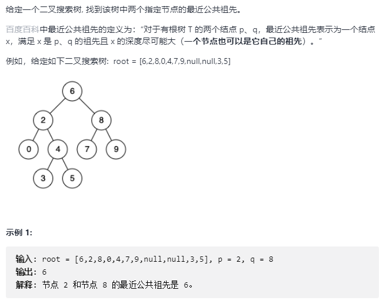
    
    - 解题思路
		
        情形 1：
		
        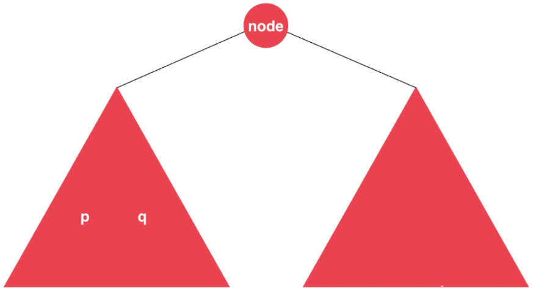
        
        情形 2：
        
        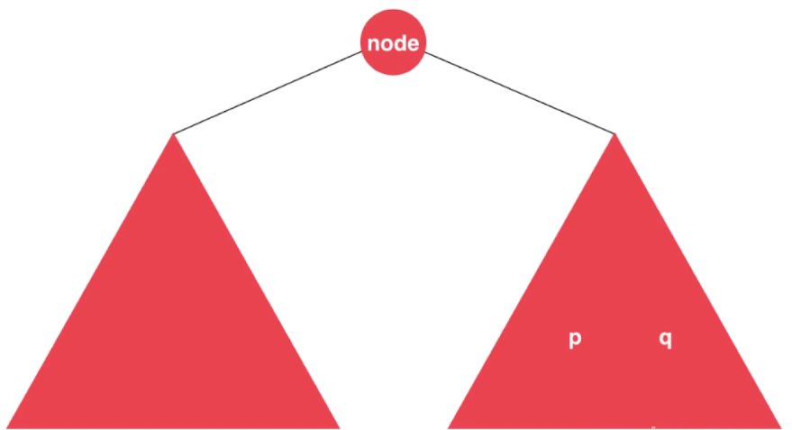
        
        情形 3：
        
        node 就是 公共祖先
        
        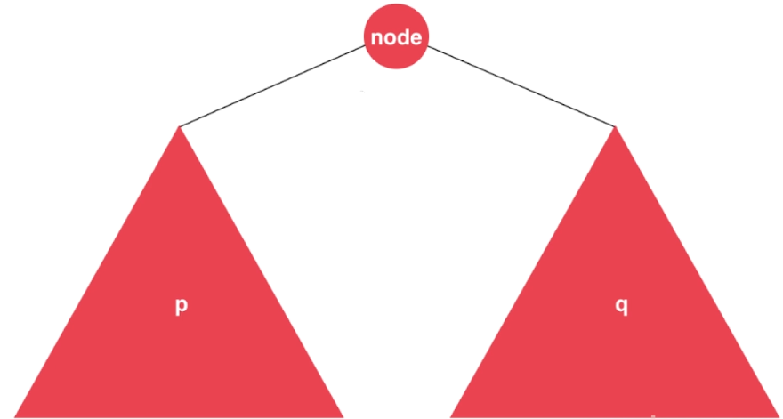
        
        情形 4：
        
        p 是祖先
        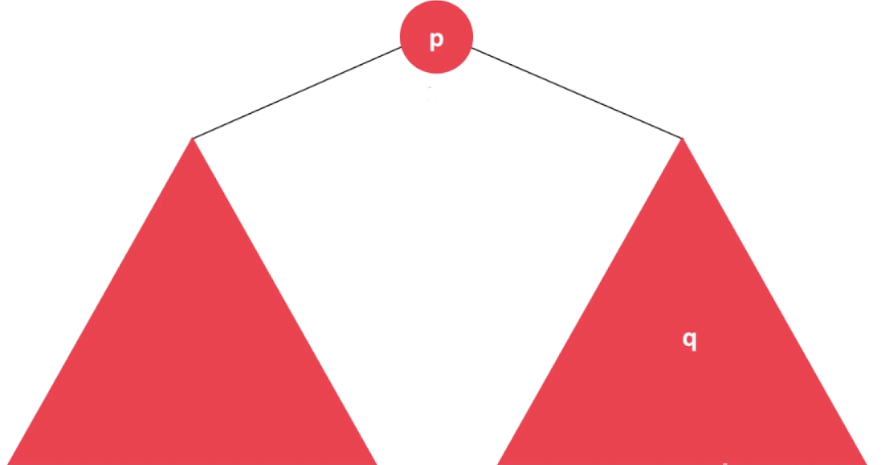
        
        情形 5：
        
        q 是祖先
        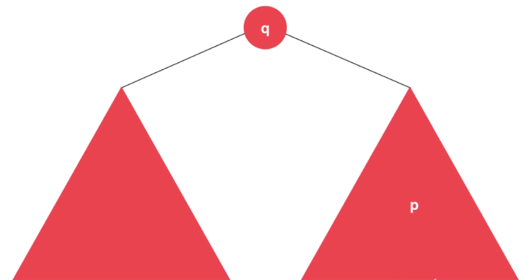
        
  - 核心代码

	```C++
    TreeNode* lowestCommonAncestor(TreeNode* root, TreeNode* p, TreeNode* q) {
        if (root == NULL)
        	return NULL;
        
        if ( p->val < root-> val && q->val < root->val)
        	return lowestCommonAncestor(root->left, p, q);
        if ( p->val > root-> val && q->val > root->val)
        	return lowestCommonAncestor(root->right, p, q);
            
        return root;
    }
    ```