## 递归与回溯

- **1. 电话号码的字母组合**

	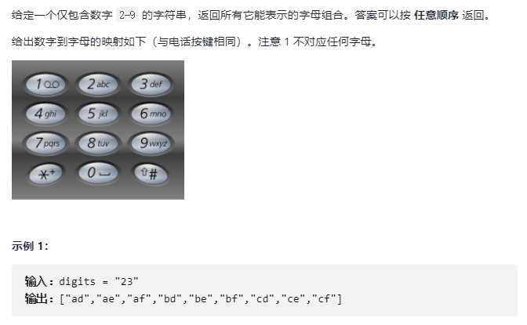
    
    - 解题思路
    
    	树形问题，采用递归思想
        
        特点：从根节点开始到达叶子结点组成答案
        
        回溯法是暴力解法的主要实现手段
        
        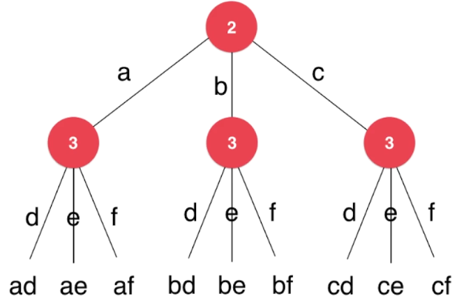
        
    - 解题代码

		```C++
        // 数字到字母的映射
        const string letterMap[10] = {
            " ",    //0
            "",     //1
            "abc",  //2
            "def",  //3
            "ghi",  //4
            "jkl",  //5
            "mno",  //6
            "pqrs", //7
            "tuv",  //8
            "wxyz"  //9
    	};
        
        vector<string> res;
        
        // s中保存了此时从digits[0...index-1]翻译得到的一个字母字符串
        // 找和digits[index]匹配的字母, 获得digits[0...index]翻译得到的解
        void findCombination(const string &digits, int index, const string &s){
        	if (index == digits.size()) {
            	res.push_back(s);
                return; // 这是返回上一个节点
            }
            
            char c = digits[index];
            string letters = letterMap[c- '0'];
            
            for (int i=0; i<letters.size(); ++i) {
            	findCombination(digits, index+1, s + letters[i]);
                // 回溯 递归找到答案或者没有找到，就会产生回溯
            }
       		
            return;
        }	
        
        vector<string> letterCombinations(string digits) {
        	res.clear();
            
            if (digits == "")
            	return res;
            
            // 
            findCombination(digits, 0, "");
            
            return res;
        }
        ```
        
- **2. 全排列**        

	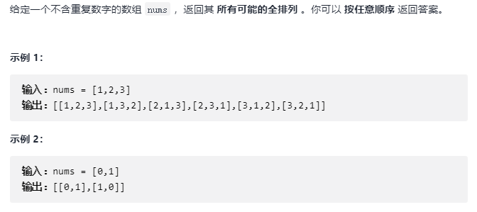
    
    - 解题思路

		通过递归树，都是不断 “使用” 来进行递归
 
 		$$Permus(nums[0...n-1]) = \{取出一个数字\} + Permus(nums[0...n-1] - 去掉这个数字)$$
 
		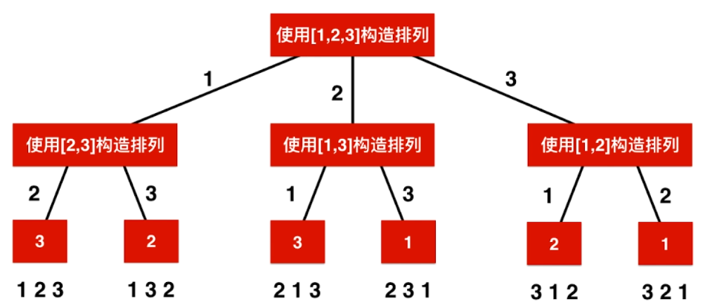
        
    - 核心代码

		```C++
        vector<vector<int>> res;
    	vector<bool> used;
        
        // 全排列参数
        // nums 搜索的范围 index 标志 递归的层级，同时表示 index 之前的 nums 在之前已经考虑了 p 存储中间结果
        void generatePermutation(const vector<int>& nums, int index, vector<int>& p){
        	if (index == nums.size()) {
            	res.push_back(p);
                return;
            }
            
            for (int i=0; i<nums.size(); ++i) {
            	if (!used[i]) {
                	 used[i] = true;
                    p.push_back(nums[i]);
                    generatePermutation(nums, index + 1, p );
                    // 回溯状态返回
                    p.pop_back();
                    used[i] = false;
                }
           }
           
           return;
        }
        
        vector<vector<int>> permute(vector<int>& nums) {
        	res.clear();
            
            if(nums.size() == 0)
            	return res;
                
            used = vector<bool>(nums.size(), false);
            vector<int> p;
            generatePermutation(nums, 0, p);
            
            return res;
        }
        ```

- **3. 组合**

	 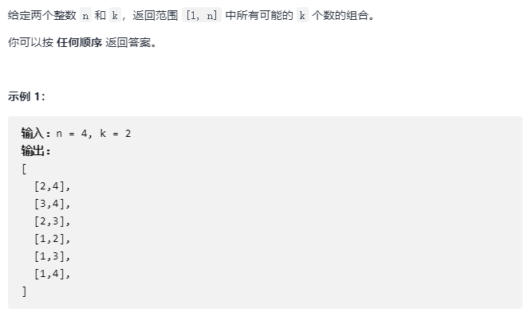   
     
     - 解题思路
 
 		标注红色表明同样的递归流程
 		
        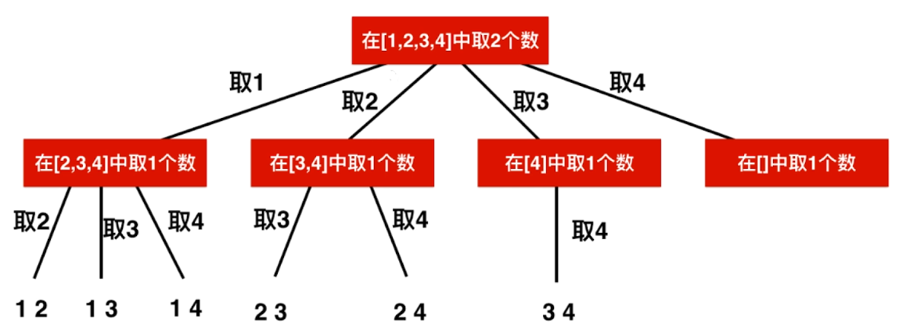   
        
     - 核心代码

		```C++
        vector<vector<int>> res;
        
        // 求解C(n,k), 当前已经找到的组合存储在c中, 需要从start开始搜索新的元素
    	void generateCombinations(int n, int k, int start, vector<int> &c){
        	if (c.size() == k) {
            	res.push_back(c);
                return;
            }
            
            // 不能每次从头开始，需要继续向后遍历
            for (int i=start；i<=n;i++) {
            	c.push_back(i);
                generateCombinations(n, k, i+1, c);
                c.pop_back();
            }
            
            return;
        }	
        
        vector<vector<int>> combine(int n, int k) {
            res.clear();
            if( n <= 0 || k <= 0 || k > n )
                return res;

            vector<int> c;
            generateCombinations(n, k, 1, c);

            return res;
    	}
        ```

 - 解题优化

	回溯法的剪枝，比如在此问题中，最后一个取 4 实际上并不需要，具体如下
    
    ```C++
    // 此时 还需要 k - c.size() 个空位，所以 [i, n] 至少有 k - c.size() 个元素
    for (int i=start；i<=n- (k - c.size()) + 1;i++) {
        c.push_back(i);
        generateCombinations(n, k, i+1, c);
        c.pop_back();
    }
    ```
    
- **4. 单词搜索**    

	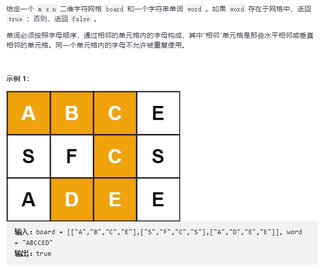   
    
    - 解题思路

		二维平面的回溯方法
        
        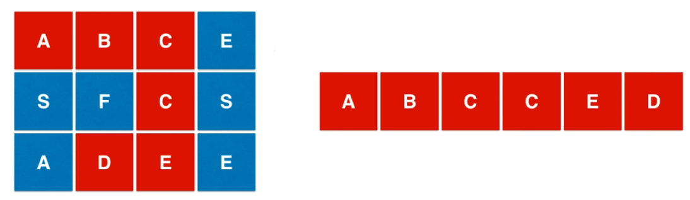 
        
        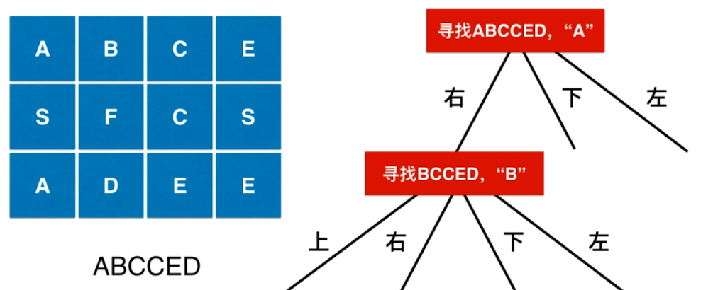  
         
  - 核心代码

	```C++
    int d[4][2] = {{-1, 0}, {0,1}, {1, 0}, {0, -1}};
    int m, n;
    vector<vector<bool>> visited;

    bool inArea(int x, int y){
        return x >= 0 && x < m && y >= 0 && y < n;
    }
    
    // 从board[startx][starty]开始, 寻找word[index...word.size())
    bool searchWord(const vector<vector<char>> &board, const string& word, int index, int startx, int starty ){

        //assert(inArea(startx,starty));
        if(index == word.size() - 1)
            return board[startx][starty] == word[index];

        if(board[startx][starty] == word[index]){
            visited[startx][starty] = true;
            // 从startx, starty出发,向四个方向寻
            for(int i = 0 ; i < 4 ; i ++){
                int newx = startx + d[i][0];
                int newy = starty + d[i][1];
                if(inArea(newx, newy) && !visited[newx][newy] &&
                   searchWord(board, word, index + 1, newx, newy))
                    return true;
            }
            // 回溯
            visited[startx][starty] = false;
        }
        return false;
    }
    
    bool exist(vector<vector<char>>& board, string word) {

        m = board.size();
        assert(m > 0);
        n = board[0].size();
        assert(n > 0);

        visited = vector<vector<bool>>(m, vector<bool>(n, false));
		// 遍历每个可行的起始点
        for(int i = 0 ; i < board.size() ; i ++)
            for(int j = 0 ; j < board[i].size() ; j ++)
                return searchWord(board, word, 0, i, j)
                    
        return false;
    }
    ```
    
- **5. 岛屿数量**     

	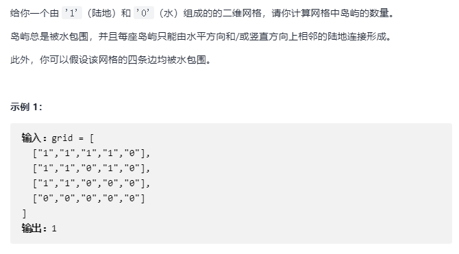  
    
   - 核心代码

		```C++
        int d[4][2] = {{0, 1}, {1, 0}, {0, -1}, {-1, 0}};
        int m, n;
        vector<vector<bool>> visited;

        bool inArea(int x, int y){
            return x >= 0 && x < m && y >= 0 && y < n;
        }
        
        // 从grid[x][y]的位置开始,进行floodfill
        // 保证(x,y)合法,且grid[x][y]是没有被访问过的陆地
        void dfs(vector<vector<char>>& grid, int x, int y){

            //assert(inArea(x,y));
            visited[x][y] = true;
            for(int i = 0; i < 4; i ++){
                int newx = x + d[i][0];
                int newy = y + d[i][1];
                if(inArea(newx, newy) && !visited[newx][newy] && grid[newx][newy] == '1')
                    dfs(grid, newx, newy);
            }
            return;
        }
        
        int numIslands(vector<vector<char>>& grid) {

            m = grid.size();
            if(m == 0)
                return 0;
            n = grid[0].size();
            if(n == 0)
                return 0;

            visited = vector<vector<bool>>(m, vector<bool>(n, false));

            int res = 0;
            for(int i = 0 ; i < m ; i ++)
                for(int j = 0 ; j < n ; j ++)
                    if(grid[i][j] == '1' && !visited[i][j]){
                        dfs(grid, i, j);
                        res ++;
                    }
            return res;
   	   }
        ```

- **6. N-皇后**

	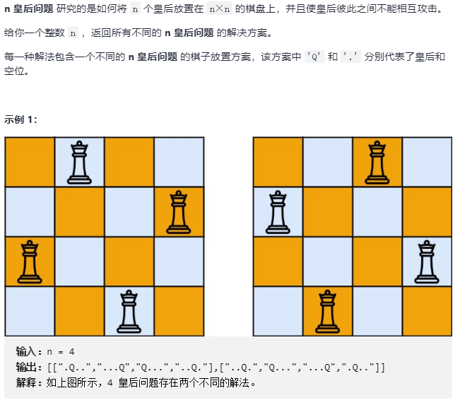  
    
    - 解题思路

		每次从行首遍历到行末作为 Q 的位置，如果都不能满足条件，则回溯上一行，改变上一行 Q 的位置
        
        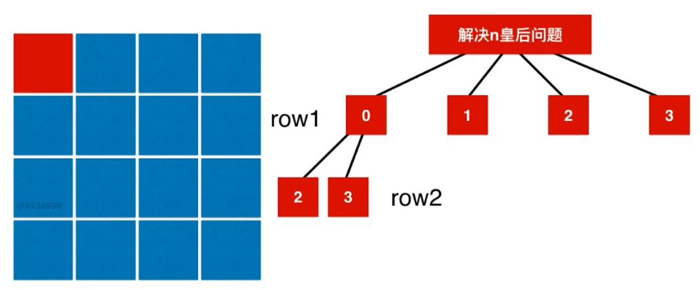 
        
        - 快速判断位置是否合法
			
            - 横竖通过 行列索引判断
            - 反对角线（行列索引坐标和相等 $i+j$固定）
            - 正对角线（$i-j + n-1 $固定） 

	- 核心代码

		```C++
        vector<bool> col, dia1, dia2;
    	vector<vector<string>> res;
        
        vector<string> generateBoard(int n, vector<int> &row){
            assert(row.size() == n);
            vector<string> board(n, string(n, '.'));
            for(int i = 0 ; i < n ; i ++)
                board[i][row[i]] = 'Q';
            return board;
        }
        
        // 尝试在一个n皇后问题中, 摆放第index行的皇后位置
        void putQueen(int n, int index, vector<int> &row){

            if(index == n){
                res.push_back(generateBoard(n, row));
                return;
            }

            for(int i = 0 ; i < n ; i ++)
                // 尝试将第index行的皇后摆放在第i列
                if(!col[i] && !dia1[index + i] && !dia2[index - i + n - 1]){
                    row.push_back(i);
                    col[i] = true;
                    dia1[index + i] = true;
                    dia2[index - i + n - 1] = true;
                    putQueen(n, index + 1, row);
                    // 回溯
                    col[i] = false;
                    dia1[index + i] = false;
                    dia2[index - i + n - 1] = false;
                    row.pop_back();
                }

            return;
        }
        
        vector<vector<string>> solveNQueens(int n) {

            res.clear();

            col = vector<bool>(n, false);
            dia1 = vector<bool>(2*n-1, false);

            vector<int> row;
            putQueen(n, 0, row);

            return res;
        }
        ```
			