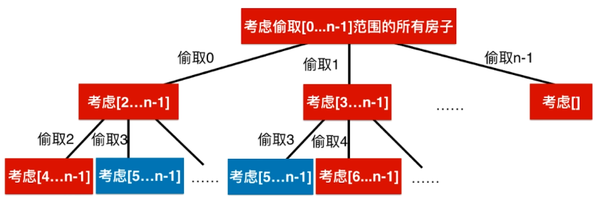

## 动态规划

- 从 斐波那契 数列看动态规划

	- 递归实现

		```C++
        // 递归求斐波那契数列
        int fib( int n ){

            num ++;

            if( n == 0 )
                return 0;

            if( n == 1 )
                return 1;

            return fib(n-1) + fib(n-2);
        }
        ```
        
        递归实现的缺点在于存在大量重复计算，可以通过递归树查看
        
        
        
    - 记忆化搜索 - 自上而下解决问题   

		```
        vector<int> memo;
        memo = vector<int>(n + 1, -1);
        int num = 0;

        // 记忆化搜索
        int fib(int n){

            num ++;

            if(n == 0)
                return 0;

            if(n == 1)
                return 1;

			// 保存中间计算结果
            if(memo[n] == -1)
                memo[n] = fib(n - 1) + fib(n - 2);

            return memo[n];
        }
        ```
        
  - 动态规划 - 自下而上解决问题

	
	```
    // 动态规划
    int fib( int n ){

        vector<int> memo(n + 1, -1);
		
        // 递归树的最底部
        memo[0] = 0;
        memo[1] = 1;
        for(int i = 2 ; i <= n ; i ++)
            memo[i] = memo[i - 1] + memo[i - 2];

        return memo[n];
    }
    ```
    
- **1. 爬楼梯**    
    
    
    
  - 解题思路

	 - 自上而下分析问题
     
     
     
     ```C++
	int calcWays(int n){

        if(n == 0 || n == 1)
            return 1;

        return calcWays(n - 1) + calcWays(n - 2);
     }
	
     int climbStairs(int n) {
         return calcWays(n);
     }
     ```
    
    - 记忆化搜索避免重复计算

		```C++
       vector<int> memo;

       int calcWays(int n){

            if(n == 0 || n == 1)
                return 1;

            if(memo[n] == -1)
                memo[n] = calcWays(n - 1) + calcWays(n - 2);

            return memo[n];
        }
        
        int climbStairs(int n) {
            memo = vector<int>(n + 1, -1);
            return calcWays(n);
        }
        ```

	- 动态规划

		```C++
        int climbStairs(int n) {

            vector<int> memo(n + 1, -1);
            memo[0] = 1;
            memo[1] = 1;
            for(int i = 2 ; i <= n ; i ++)
                memo[i] = memo[i - 1] + memo[i - 2];
            return memo[n];
    	}
        ```

- **2. 整数拆分**   

	
    
    - 解题思路

		以分割 $4$ 为例
        
        
        
        存在大量重叠子问题计算
        
        - 递归解法
        
        ```C++
        int max3(int a, int b, int c){
        	return max(a, max(b, c));
        }

        // 将n进行分割(至少分割两部分), 可以获得的最大乘积
        int breakInteger(int n){

            if(n == 1)
                return 1;

            int res = -1;
            for(int i = 1 ; i <= n - 1 ; i ++)
                res = max3(res, i * (n - i), i * breakInteger(n - i));
            return res;
        }
        
        int integerBreak(int n) {
            assert(n >= 1);
            return breakInteger(n);
        }
        ```
        
        - 记忆化搜索

		```C++
        vector<int> memo;

        int max3(int a, int b, int c){
            return max(a, max(b, c));
        }

        // 将n进行分割(至少分割两部分), 可以获得的最大乘积
        int breakInteger(int n){

            if(n == 1)
                return 1;
            
			// 记忆化
            if(memo[n] != -1)
                return memo[n];

            int res = -1;
            for(int i = 1 ; i <= n - 1 ; i ++)
                res = max3(res, i * (n - i) , i * breakInteger(n - i));
            memo[n] = res;
            return res;
        }
        
        int integerBreak(int n) {
            assert(n >= 1);
            memo = vector<int>(n+1, -1)
            return breakInteger(n);
        }
        ```
        
        - 动态规划

		```python
        int max3(int a, int b, int c ){
            return max(max(a, b), c);
        }
        
        int integerBreak(int n) {

            assert(n >= 1);

            // memo[i] 表示将数字i分割(至少分割成两部分)后得到的最大乘积
            vector<int> memo(n + 1, -1);

            memo[1] = 1;
            for(int i = 2 ; i <= n ; i ++)
                // 求解memo[i]
                for(int j = 1 ; j <= i - 1 ; j ++)
                    memo[i] = max3(memo[i], j * (i - j), j * memo[i - j]);

            return memo[n];
        }
        ```

- **3. 打家劫舍**

  
  
  - 解题思路

	- 暴力递归解法

		检查所有房子的组合，对每一个组合，检查是否有相邻的房子，如果没有，记录其价值，找到最大值。注意这里函数的定义为 考虑偷取 [x...n-1] 范围里的房子
        
        
	
     - 构建状态定义和状态转移方程：

		- 状态定义

			考虑偷取 $[x, ... , n-1]$ 范围里的房子
            
            状态定义了递归函数的接口定义
            
        - 状态转移方程    
    
    	$$f(0) = max(v(0) + f(2), v(1) + f(3), v(2) + f(4),..., v(n-3) + f(n-1), v(n-2), v(n-1))$$
        
        实际上递归函数的处理流程
        
        ```C++
        int tryRob(vector<int>& nums, int index) {
        	if (index >= nums.size())
            	return 0;
            
            int res = 0;
            for (int i=index; i<nums.size(); i++)
            	res = max(res, nums[i] + tryRob(nums, i+2));
                
            return res
        }
        
        int rob(vector<int>& nums) {
        	return tryRob(nums, 0);
        }
        ```
        
	- 递归解法，记忆化搜索

		```C++
         // memo[i] 表示考虑抢劫 nums[i...n) 所能获得的最大收益
        vector<int> memo;

        // 考虑抢劫nums[index...nums.size())这个范围的所有房子
        int tryRob(const vector<int> &nums, int index){

            if(index >= nums.size())
                return 0;

            if(memo[index] != -1)
                return memo[index];

            int res = 0;
            for(int i = index ; i < nums.size() ; i ++)
                res = max(res, nums[i] + tryRob(nums, i + 2));
            memo[index] = res;
            return res;
        }
        
        int rob(vector<int>& nums) {

            memo = vector<int>(nums.size(), -1);
            return tryRob(nums, 0);
   	 }
        ```

	- 动态规划

		```C++
        int rob(vector<int>& nums) {

            int n = nums.size();
            if( n == 0 )
                return 0;

            // memo[i] 表示考虑抢劫 nums[0...i] 所能获得的最大收益
            vector<int> memo(n, -1);
            memo[n-1] = nums[n-1];
            for(int i = n-2 ; i >= 0 ; i --)
                for (int j = i; j < n; j++)
                    memo[i] = max(memo[i],
                                  nums[j] + (j + 2 < n ? memo[j + 2] : 0));

            return memo[0];
        }
        ```

- **4. 0-1背包**

	给定n个重量为 w_1, w_2，w_3,…, w_n，价值为 v_1 , v_2 , v_3 ,…, v_n  的物品和容量为 C 的背包，求这个物品中一个最有价值的子集，使得在满足背包的容量的前提下，包内的总价值最大。
    
 - 解题思路

	- 暴力解法

		每一件物品都可以放进背包，也可以不放进背包
        
        - 递归函数定义（状态定义）

			$F(n, C)$表示将前 $n$ 个物品放进容量为 $C$ 的背包里，得到的最大的价值。
            
        - 递归函数处理流程（状态转移方程）

			$$F(i,c) = max(F(i-1,c), v(i) + F(i-1,c-w(i)))$$ 
            
        ```C++
        // 用 [0...index]的物品,填充容积为c的背包的最大价值
        int bestValue(const vector<int> &w, const vector<int> &v, int index, int c){

            if(c <= 0 || index < 0)
                return 0;
			// 获取不选择 该 index 的物品 的最优价值
            int res = bestValue(w, v, index-1, c);
            if(c >= w[index])
                res = max(res, v[index] + bestValue(w, v, index - 1, c - w[index]));
            return res;
        }
        
        int knapsack01(const vector<int> &w, const vector<int> &v, int C){
            assert(w.size() == v.size() && C >= 0);
            int n = w.size();
            if(n == 0 || C == 0)
                return 0;
            return bestValue(w, v, n - 1, C);
        }
        ```
        
   - 记忆化搜索    

		```C++
        vector<vector<int>> memo;

        // 用 [0...index]的物品,填充容积为c的背包的最大价值
        int bestValue(const vector<int> &w, const vector<int> &v, int index, int c){

            if(c <= 0 || index < 0)
                return 0;

            if(memo[index][c] != -1)
                return memo[index][c];

            int res = bestValue(w, v, index-1, c);
            if(c >= w[index])
                res = max(res, v[index] + bestValue(w, v, index - 1, c - w[index]));
            memo[index][c] = res;
            return res;
        }

		int knapsack01(const vector<int> &w, const vector<int> &v, int C){
            assert(w.size() == v.size() && C >= 0);
            int n = w.size();
            if(n == 0 || C == 0)
                return 0;

            memo = vector<vector<int>>(n, vector<int>(C+1, -1));
            return bestValue(w, v, n - 1, C);
        }
        ```
  
   - 动态规划

		```C++
        int knapsack01(const vector<int> &w, const vector<int> &v, int C){
            assert(w.size() == v.size() && C >= 0);
            int n = w.size();
            if(n == 0 || C == 0)
                return 0;

            vector<vector<int>> memo(n, vector<int>(C + 1,0));

            for(int j = 0 ; j <= C ; j ++)
                memo[0][j] = (j >= w[0] ? v[0] : 0 );

            for(int i = 1 ; i < n ; i ++)
                for(int j = 0 ; j <= C ; j ++){
                    memo[i][j] = memo[i-1][j];
                    if(j >= w[i])
                    	// memo[i - 1][j - w[i]] 剩下的重量所有的最大值
                        memo[i][j] = max(memo[i][j], v[i] + memo[i - 1][j - w[i]]);
                }
            return memo[n - 1][C];
        }
        ```
        
     - 优化空间复杂度

		 由于当前最优值仅仅与上一行最优值有关，所以不需要维护每一行的最优值，只要维护两行就可以了
         
         
         
         
         上面一行处理 i 为 偶数；下面一行处理 i 为奇数
         
         ```C++
         int knapsack01(const vector<int> &w, const vector<int> &v, int C){
            assert(w.size() == v.size() && C >= 0);
            int n = w.size();
            if( n == 0 && C == 0 )
                return 0;

            vector<vector<int>> memo(2, vector<int>(C + 1, 0));

            for(int j = 0 ; j <= C ; j ++)
                memo[0][j] = (j >= w[0] ? v[0] : 0);

            for(int i = 1 ; i < n ; i ++)
                for(int j = 0 ; j <= C ; j ++){
                    memo[i % 2][j] = memo[(i-1) % 2][j];
                    if(j >= w[i])
                        memo[i % 2][j] = max(memo[i % 2][j], v[i] + memo[(i-1) % 2][j - w[i]]);
                }
            return memo[(n-1) % 2][C];
        }
         ```