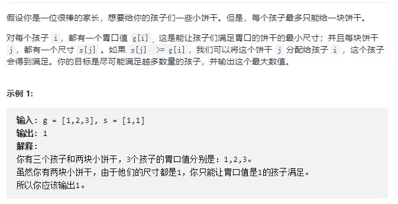
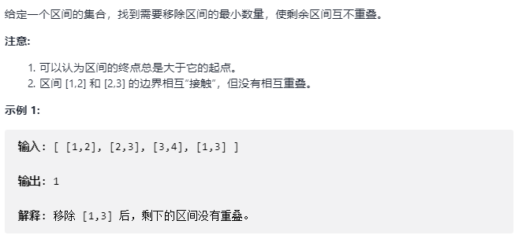

## 贪心算法

- 贪心算法概述

	每次尝试使用局部最优的值（最小或者最大）作为贪心，往往结合排序算法

- **1. 分发饼干**    	
	
    

	- 解题思路

		每次尝试将最大的饼干给尽可能贪心的小朋友
        
        ```C++
        int findContentChildren(vector<int>& g, vector<int>& s) {

            sort(g.begin(), g.end(), greater<int>());
            sort(s.begin(), s.end(), greater<int>());

            int gi = 0, si = 0;
            int res = 0;
            while(gi < g.size() && si < s.size()){
                if(s[si] >= g[gi]){
                    res ++;
                    si ++;
                    gi ++;
                }
                else
                    gi ++;
            }

            return res;
        }
        ```
        
- **2. 无重叠区间**         

	
    
    - 解题思路

		- 暴力解法

			找出所有子区间的组合，判断不重叠
            
        - 动态规划

			保留最长的子区间序列保证不重合，类似最长上升子序列
            
            需要先进行排序
            
            ```C++
            /// Definition for an interval.
            struct Interval {
                int start;
                int end;
                Interval() : start(0), end(0) {}
                Interval(int s, int e) : start(s), end(e) {}
            };

            bool compare(const Interval &a, const Interval &b){

                if(a.start != b.start)
                    return a.start < b.start;
                return a.end < b.end;
            }
            
            int eraseOverlapIntervals(vector<Interval>& intervals) {

                if(intervals.size() == 0)
                    return 0;

                sort(intervals.begin(), intervals.end(), compare);

                // memo[i]表示以intervals[i]为结尾的区间能构成的最长不重叠区间序列
                vector<int> memo(intervals.size(), 1);
                for(int i = 1 ; i < intervals.size() ; i ++)
                    // memo[i]
                    for(int j = 0 ; j < i ; j ++)
                        if(intervals[i].start >= intervals[j].end)
                            memo[i] = max(memo[i], 1 + memo[j]);

                int res = 0;
                for(int i = 0; i < memo.size() ; i ++)
                    res = max(res, memo[i]);

                return intervals.size() - res;
            }
            ```
            
     - 贪心算法       
            
           按照区间结尾进行排序，每次选择结尾最早的，且和前一个区间不重叠的区间，结尾越早，越不容易与后续的区间重叠
            
            ```C++
            struct Interval {
                int start;
                int end;
                Interval() : start(0), end(0) {}
                Interval(int s, int e) : start(s), end(e) {}
            };

            bool compare(const Interval &a, const Interval &b){
                if(a.end != b.end)
                    return a.end < b.end;
                return a.start < b.start;
            }
            
            int eraseOverlapIntervals(vector<Interval>& intervals) {

                if(intervals.size() == 0)
                    return 0;

                sort(intervals.begin(), intervals.end(), compare);

                int res = 1;
                int pre = 0;
                for(int i = 1 ; i < intervals.size() ; i ++)
                    if(intervals[i].start >= intervals[pre].end){
                        res ++;
                        pre = i;
                    }

                return intervals.size() - res;
            }
            ```